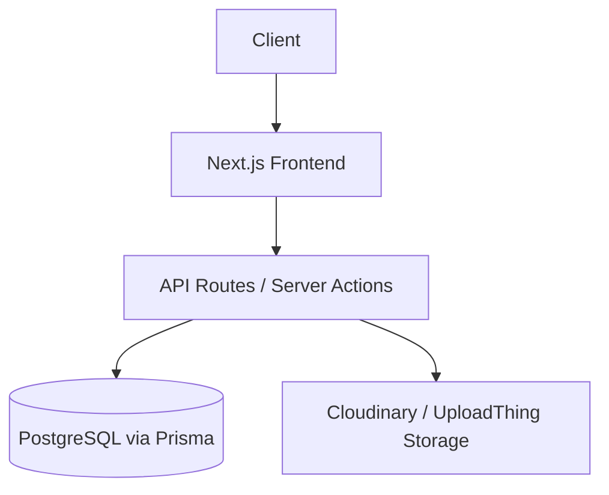

<p align="center">
  
</p>

# 🚀 MMTPL Integrated Digital Platform

A modern enterprise-grade digital ecosystem for Man Machine Technocrats Pvt. Ltd. (MMTPL) featuring:

- Corporate Website
- Project Management Portal
- Employee Management System
- Client Dashboard
- Document Management
- Analytics & Reporting

Built for scalability, performance, and industrial operations.

<p align="center">
  
  
  
  
  
</p>

---

## 📖 Overview

MMTPL Integrated Digital Platform is designed to digitize industrial operations, improve workforce productivity, streamline project execution, and enhance client engagement through a centralized, high-performance system.

---

## 🛣 Project Phases Roadmap

- [x] **Phase 1: Corporate Website & Digital Presence** *(Completed)*
- [x] **Phase 2: Enterprise Dashboards (Admin, Client, Employee)** *(Completed)*
- [ ] **Phase 3: Advanced HRMS Integration** *(Coming Soon)*
- [ ] **Phase 4: Advanced ERP / Client Billing** *(Coming Soon)*

---

## 🏗 System Architecture



---

## ✨ Features

### Phase 1: Corporate Website (Live)
- Responsive, Ultra-Fast Design
- SEO Optimized Next.js App Router
- Dynamic Project & Equipment Showcase
- Careers Portal with Resume Upload

### Phase 2: Enterprise Dashboards (Live)
- Comprehensive Role-Based Access Control (Admin, Employee, Client)
- Project Tracking & Task Management
- Workforce Attendance & Leave Management
- Document Management & Invoicing
- Real-time Analytics & Reporting

---

## 🛠 Tech Stack

**Frontend:**
- Next.js 15
- React 19
- TypeScript
- Tailwind CSS v4
- Framer Motion

**Backend & Database:**
- Node.js (Vercel Serverless)
- PostgreSQL
- Prisma ORM

**Storage & Media:**
- Cloudinary
- UploadThing

---

## 📂 Project Structure

```bash
mmtpl-website/
│
├── public/                # Static assets (images, JSON maps, icons)
├── src/
│   ├── app/               # Next.js App Router (Pages & API routes)
│   ├── components/        # Reusable React components (UI, Motion, Sections)
│   ├── data/              # Hardcoded data structures (Services, Projects, etc.)
│   └── lib/               # Utility functions and Prisma client
├── prisma/                # Database schema and migrations
└── README.md              # Project documentation
```

---

## ⚙️ Installation

```bash
# Clone the repository
git clone https://github.com/AnantSoni360/mmtpl-website.git

# Navigate to project
cd mmtpl-website

# Install dependencies
npm install

# Run the development server
npm run dev
```

---

## 🔑 Environment Variables

```env
DATABASE_URL="your-postgresql-url"
UPLOADTHING_TOKEN="..."
NEXT_PUBLIC_CLOUDINARY_CLOUD_NAME="..."
NEXT_PUBLIC_CLOUDINARY_UPLOAD_PRESET="..."
```

---

## ⚡ Performance

- **Lighthouse Score:** 98+
- **SEO Score:** 100
- **Accessibility:** 95+
- **First Contentful Paint:** < 1.5s
- **Cumulative Layout Shift:** 0.00

---

## 🚀 Deployment

**Production Environment:**
- Frontend & Backend → **Vercel**
- Database → **PostgreSQL (Neon / Supabase)**
- Media Storage → **Cloudinary / UploadThing**

---

## 👨‍💻 Contributors

- **Anant Soni**
- MMTPL Development Team

---

## 📄 License

Private Proprietary Software
© MMTPL